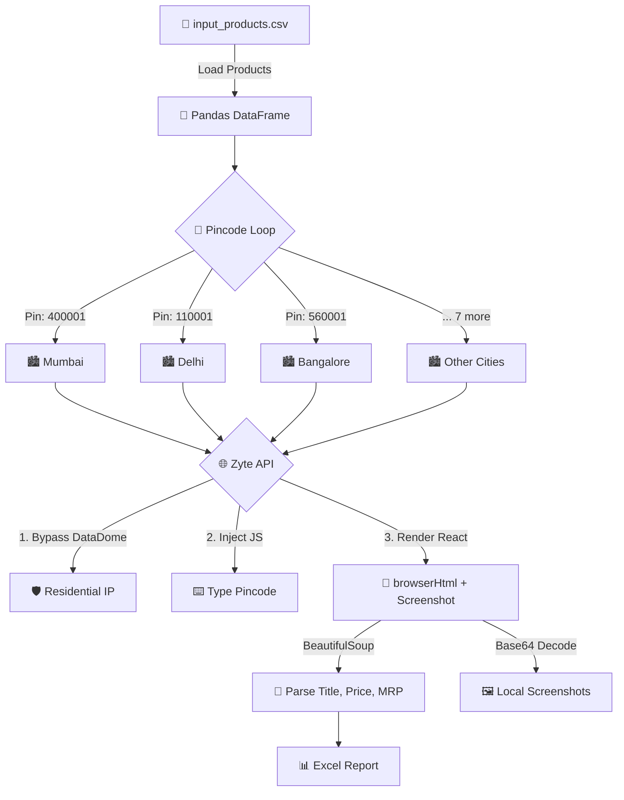

<div align="center">

# 🛒 Blinkit Price Tracker

**A production-grade price scraping bot that defeats Blinkit's DataDome WAF, Cloudflare CDN, and mandatory location gate to extract real-time product prices across 10 Indian cities.**

[](https://python.org)
[](https://www.zyte.com/)
[](https://pypi.org/project/beautifulsoup4/)
[](https://pandas.pydata.org)
[](LICENSE)

</div>

---

## 📌 Problem Statement

Quick-commerce platforms like **Blinkit** (formerly Grofers) deliver groceries in 10 minutes. For brands selling on these platforms, monitoring their product prices, discounts, and stock availability across different cities is critical for competitive intelligence — but Blinkit makes this **exceptionally difficult** to automate.

---

## 🛡️ The 4 Layers of Anti-Bot Protection

Blinkit employs one of the most aggressive anti-scraping stacks in Indian e-commerce. Here's what any scraping attempt must defeat:

### Layer 1: DataDome — Behavioral Bot Detection

Blinkit uses **[DataDome](https://datadome.co/)**, an enterprise-grade bot mitigation platform that costs companies $50,000+/year. DataDome operates at the CDN edge and analyzes:

- **TLS Fingerprinting** — Every SSL/TLS handshake has a unique "fingerprint" based on the cipher suites, extensions, and protocol versions the client sends. Python's `requests` library produces a distinctly different TLS fingerprint than Chrome, which DataDome instantly flags.
- **Canvas & WebGL Hashing** — DataDome executes invisible JavaScript that renders graphics to the browser's Canvas API and extracts a hash. Headless browsers produce a different hash than real browsers.
- **Navigator Properties** — Checks `navigator.webdriver`, `navigator.plugins`, `navigator.languages`, and Chrome DevTools protocol detection to identify automation frameworks.

**Result without bypass:** `403 Forbidden` or a CAPTCHA slider.

### Layer 2: Cloudflare CDN

All requests to `blinkit.com` pass through **Cloudflare**, which provides:

- **IP Reputation Scoring** — Data center IPs (AWS, GCP, Azure) are automatically flagged and challenged. Only residential/mobile IPs pass cleanly.
- **Rate Limiting** — Excessive requests from a single IP are throttled and eventually blocked.
- **JavaScript Challenge Pages** — Cloudflare's `cf_clearance` cookie requires a real browser to solve an invisible JavaScript challenge before accessing the site.

**Result without bypass:** `403 Forbidden` with `__cf_bm` cookie rejection.

### Layer 3: React SPA Location Gate

Even if you bypass DataDome and Cloudflare, Blinkit's frontend is a **React Single Page Application** that refuses to render any product data until a valid delivery location is set:

- The site loads with a **full-screen location overlay** that intercepts all routing
- The overlay triggers `navigator.geolocation.getCurrentPosition()` which returns nothing in automated environments
- Product pages return empty shells without a valid location cookie

**Result without bypass:** Empty page with no price data.

### Layer 4: Dynamic CSS Class Names

Blinkit uses **Tailwind CSS** with build-time class generation. CSS selectors like `.tw-text-400.tw-font-bold` are stable, but component-level classes (e.g., `.LocationSearchList__LocationListContainer-sc-93rfr7-0`) are generated by Styled Components and can change on each deployment.

---

## 🧠 The Solution: Zyte API + Client-Side JavaScript Injection

### Defeating Layers 1 & 2: Zyte as a Proxy Farm

Instead of fighting DataDome and Cloudflare directly, this bot delegates browser rendering to the **[Zyte API](https://www.zyte.com/)** — an enterprise scraping platform that provides:

| Capability | How it defeats Blinkit |
|-----------|----------------------|
| **Residential IP Pool** | Routes requests through real ISP connections, bypassing Cloudflare's datacenter IP blocks |
| **Real Browser Fingerprints** | Presents authentic TLS fingerprints, Canvas hashes, and navigator properties that pass DataDome |
| **cf_clearance Handling** | Automatically solves Cloudflare's JavaScript challenges |
| **Full JavaScript Execution** | Renders the React SPA completely before returning HTML |

### Defeating Layer 3: Human-Like Typing Simulation

The bot injects a custom JavaScript payload into Zyte's remote browser. This payload doesn't just set a value — it physically **simulates human keyboard interaction** to fool DataDome's behavioral analysis:

```javascript
async function typeText(element, text, delay = 80) {
    element.focus();
    for (const char of text) {
        // Bypass React's synthetic event system by using the native setter
        const nativeInputValueSetter = Object.getOwnPropertyDescriptor(
            window.HTMLInputElement.prototype, 'value'
        ).set;
        nativeInputValueSetter.call(element, element.value + char);

        // Fire the exact sequence of events a real keyboard produces
        element.dispatchEvent(new Event('input', { bubbles: true }));
        element.dispatchEvent(new KeyboardEvent('keydown', { key: char }));
        element.dispatchEvent(new KeyboardEvent('keypress', { key: char }));
        element.dispatchEvent(new KeyboardEvent('keyup', { key: char }));

        // Random delay between 80ms–140ms to mimic human typing cadence
        await sleep(delay + Math.random() * 60);
    }
}
```

**The key trick:** The script types the pincode, then **clears the input and types it again**. This double-entry pattern is necessary because React's virtual DOM sometimes misses the first batch of programmatic `input` events. The clear-and-retype forces React's `onChange` handler to fire correctly.

**The full automation flow:**
1. Wait for `input[name="select-locality"]` to appear in the DOM
2. Click the input field → wait 400ms
3. Type pincode character by character with random delays
4. Clear the input completely
5. Retype the pincode (triggers React onChange)
6. Wait for `.LocationSearchList__LocationListContainer` dropdown
7. Click the first location suggestion
8. Navigate `window.location.href` to the product URL

### Defeating Layer 4: Tailwind CSS Selectors

Instead of relying on fragile component-level class names, the parser uses Blinkit's **Tailwind utility classes** which are semantic and stable:

| Data Point | CSS Selector | Why it's stable |
|-----------|-------------|----------------|
| **Title** | `div.tw-line-clamp-50` | Tailwind's line-clamp utility won't change unless they redesign the layout |
| **Selling Price** | `div.tw-text-400.tw-font-bold` | Standard Tailwind text size + weight |
| **MRP** | `span.tw-line-through` | Tailwind's strikethrough class for original price |

---

## 🏗️ Architecture



---

## 📊 Output Format

The bot generates an Excel report with the following columns:

| Column | Description |
|--------|-------------|
| `productid` | Blinkit product identifier (prid or slug) |
| `title` | Product name as displayed on Blinkit |
| `selling_price` | Current selling price (₹) |
| `mrp` | Maximum Retail Price (₹) |
| `discount_pct` | Calculated discount percentage |
| `out_of_stock` | Whether the product is currently unavailable |
| `pincode` | Pincode where the product was checked |
| `city` | City name |
| `url` | Full product URL on Blinkit |
| `screenshot_path` | Local path to the captured product page screenshot |
| `scraped_at` | Timestamp of when the data was collected (IST) |

---

## 🛠️ Installation & Setup

### Prerequisites
- Python 3.10+
- A [Zyte API](https://www.zyte.com/) account (free trial available)

### Steps

**1. Clone the repository**
```bash
git clone https://github.com/harshgupta170704/Blinkit-PriceTracker.git
cd Blinkit-PriceTracker
```

**2. Install dependencies**
```bash
pip install -r requirements.txt
```

**3. Configure your API key**
```bash
cp .env.example .env
# Edit .env and add your Zyte API key
```

---

## 🚀 Usage

**1.** Populate `input_products.csv` with Blinkit product IDs. You can use:
- A full URL: `https://blinkit.com/prn/some-product/prid/565294`
- A relative path: `prn/some-product/prid/565294`
- Just the prid: `565294`

**2.** Run the tracker:
```bash
python blinkit_price_tracker.py
```

**3.** Terminal output:
```
2026-08-26 23:30:00 [INFO] Loaded 15 products from input_products.csv
2026-08-26 23:30:00 [INFO] ── Processing Mumbai (pincode: 400001) ──
2026-08-26 23:30:12 [INFO] ✅ prn/trimmer/prid/565294 | Mumbai scraped successfully
2026-08-26 23:30:24 [INFO] ✅ prn/razor/prid/432101 | Mumbai scraped successfully
...
2026-08-26 23:35:00 [INFO] 📊 Excel report saved to: output/blinkit_prices_20260826_233500.xlsx
2026-08-26 23:35:00 [INFO] ✅ Done! Processed 150 records across 10 cities.
```

**4.** Check `output/` for the Excel report and `screenshots/` for product page screenshots.

---

## 🔧 Tech Stack

| Technology | Purpose |
|------------|---------|
| **Python 3.10+** | Core language |
| **Zyte API** | Residential proxy + browser rendering to bypass DataDome/Cloudflare |
| **BeautifulSoup4** | HTML parsing with stable Tailwind CSS selectors |
| **Pandas** | DataFrame construction and Excel export |
| **python-dotenv** | Secure API key management via `.env` |
| **lxml** | Fast HTML parser backend |

---

## 📁 Project Structure

```
Blinkit-PriceTracker/
├── blinkit_price_tracker.py   # Main bot script
├── config.py                  # Pincodes, timeouts, and settings
├── input_products.csv         # Input: product IDs to track
├── requirements.txt           # Python dependencies
├── .env.example               # Template for API keys (copy to .env)
├── .gitignore                 # Protects .env and output files
├── CONTRIBUTING.md            # Contribution guidelines
├── LICENSE                    # MIT License
└── README.md                  # This file
```

---

## ⚠️ Disclaimer

This tool is built for **educational purposes and competitive price intelligence research**. Always respect website terms of service and rate limits. The Zyte API is a legitimate, commercial scraping platform used by enterprises worldwide.

---

<div align="center">

**Built with 🧠 by [Harsh Gupta](https://github.com/harshgupta170704)**

*If you found this useful, consider giving it a ⭐*

</div>
